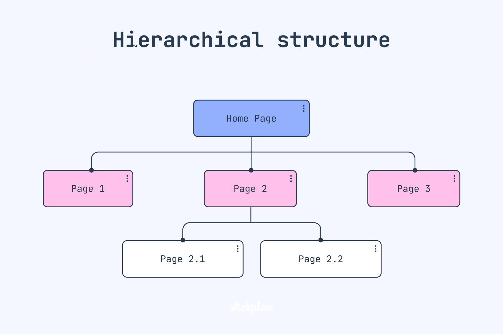
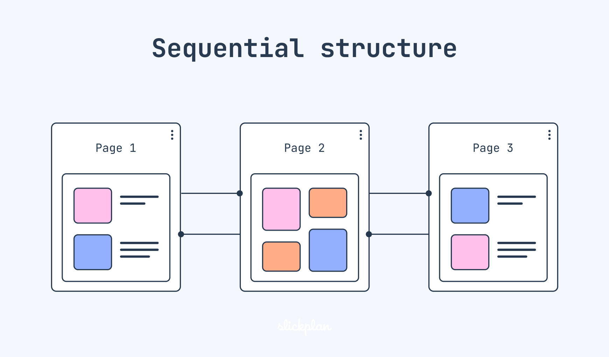
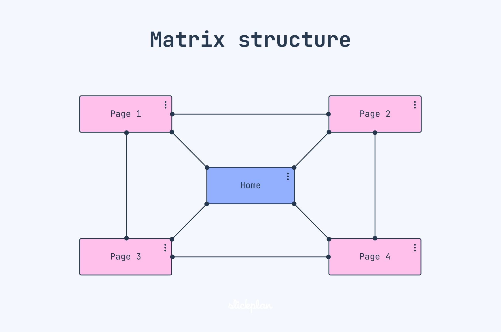
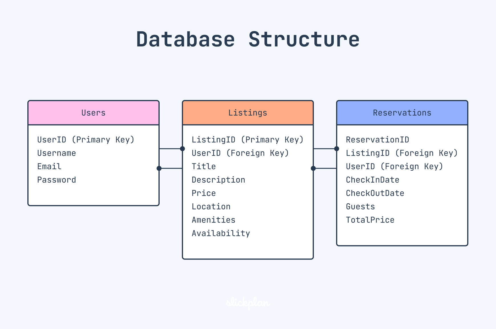

# Networking
## Networking Devices
- Most common networking devices used are:
1. **Repeaters:**
    - Used for regenerating a signal
    - Operates in physical layer of OSI model
2. **Bridge and Switches:**
    - Divides large network into smaller segments connected by it.
    - Operates in physical and data link layer

3. **Routers:**
    - It routes the packets from source post to destination host using routing protocols.
    - Operates in physical,datalink and network layer.

4. **Gateways:**
    - It is called as protocol converter ,since it connects networks operating on different protocols.
    - The gateway is generally a software installed within router.
    - Operates in all layers of osi model.

## OSI Model
- Each layer of OSI model handles the following things
1. **Physical**
    - Type of Encoding of bits
    - Transmission mode(duplex,simplex,half duplex)
    - Data Rate
    - Other physical properties
2. **Data Link Layer**
    - Framing
    - Physical Addressing
    - Flow control,Error control and access control of frames
3. **Network Layer**
    - Logical  Addressing
    - Source to destination host delivery
    - Routing
4. **Transport**
    - Process to process delivery
    - Service Port Addressing
    - Flow control
5. **Session Layer**
    - Synchronisation of data streams using checkpoints
6. **Presentation Layer**
    - Encrytion,Compression and Translation
7. **Appication Layer**
    - Specific Addressing
    - Application to access network
    - Protocols used like HTTP,FTP,Telnet
## TCP/IP Protocol Suite

## TCP vs UDP
|TCP|UDP|
|-|-|
|TCP is a **connection oriented protocol**.Connection orientation means that the communicating devices should establish a connection before transmitting data and should close the connection after transmitting the data.|UDP is the **connectionless-oriented protocol**. This is because there is no overhead for opening a connection, maintaining a connection, or terminating a connection. UDP is efficient for broadcast and multicast types of network transmission.|
|TCP is reliable as it guarantees the delivery of data to the destination router.|The delivery of data to the destination cannot be guaranteed in UDP.|
|It provides retransmission of packets.|No retransmission of packets|
|TCP provides extensive error-checking mechanisms. It is because it provides flow control and acknowledgment of data.|UDP has only the basic error-checking mechanism using checksums.|
|Sequencing of data is a feature of Transmission Control Protocol (TCP). this means that packets arrive in order at the receiver.|There is no sequencing of data in UDP. If the order is required, it has to be managed by the application layer.|
|It is heavy weight|It is light weight|
|TCP is comparatively slower than UDP.|UDP is faster, simpler, and more efficient than TCP.|

## IPv4

### Characteristics of IPv4
- **32-bit address length:** Allows for approximately 4.3 billion unique addresses.
- **Dot-decimal notation:** IP addresses are written in a format of four decimal numbers separated by dots, such as 192.168.1.1.
- **Packet structure:** Includes a header and payload; the header contains information essential for routing and delivery.
- **Checksum fields:** Uses checksums in the header for error-checking the header integrity.
- **Fragmentation:** Allows packets to be fragmented at routers along the route if the packet size exceeds the maximum transmission unit (MTU).
- **Address Resolution Protocol (ARP):** Used for mapping IP network addresses to the hardware addresses used by a data link protocol.
- **Manual and DHCP configuration:** Supports both manual configuration of IP addresses and dynamic configuration through DHCP (Dynamic Host Configuration Protocol).
- **Limited address space:** The main limitation which has led to the development of IPv6 to cater to more devices.
- **Network Address Translation (NAT):** Used to allow multiple devices on a private network to share a single public IP address.
- **Security:** Lacks inherent security features, requiring additional protocols such as IPSec for secure communications.

**DHCP(Dynamic Host Configuration Protocol)**
- It’s a network protocol used to automatically assign IP addresses and other network settings (like DNS server, gateway, etc.) to devices on a network.
- It works in the following steps:
    1. **Client sends a DHCPDISCOVER**
    
    * When a device (e.g., your laptop) joins the network, it sends a broadcast message saying:  
        ➤ _"Hey! Is there a DHCP server? I need an IP!"_

    2. **DHCP server replies with a DHCPOFFER**
    
    * It responds with an available IP address and other settings.  
        ➤ _"You can use 192.168.1.50 for now."_

    3. **Client replies with a DHCPREQUEST**
    
    * The device says:  
        ➤ _"Okay, I want to use that address."_

    4. **DHCP server confirms with a DHCPACK**
    
    * The server finalizes the lease and says:  
        ➤ _"Done! That IP is yours for the next 24 hours."_

### Drawbacks of IPv4
- **Limited Address Space:** IPv4 has a limited number of addresses, which is not enough for the growing number of devices connecting to the internet.
- **Complex Configuration:** IPv4 often requires manual configuration or DHCP to assign addresses, which can be time-consuming and prone to errors.
- **Less Efficient Routing:** The IPv4 header is more complex, which can slow down data processing and routing.
- **Security Issues:** IPv4 does not have built-in security features, making it more vulnerable to attacks unless extra security measures are added.
- **Limited Support for Quality of Service (Quos):** IPv4 has limited capabilities for prioritizing certain types of data, which can affect the performance of real-time applications like video streaming and VoIP.
- **Fragmentation:** IPv4 allows routers to fragment packets, which can lead to inefficiencies and increased chances of data being lost or corrupted.
- **Broadcasting Overhead:** IPv4 uses broadcasting to communicate with multiple devices on a network, which can create unnecessary network traffic and reduce performance.

## IPv6
### Advantages of IPv6 over IPv4
- Other than large addressing space IPv6 provides these following benifits over IPv4:
    1. IPv6 has better hierarchical address allocation which helps in preventing expansion of routing tables. Because in hierarchical routing we need to route the destination host continent, then country,state, city, goes in this flow.
    2. Multicasting is simplified in IPv6.
    3. IPv6 provides better device mobility. This means a device can change thw network without dropping ongoing connections. Eg,  You’re on a video call, and you switch from home Wi-Fi to mobile data — IPv6 helps that switch be smooth.
    4. IPv6 provides better potential for end-to-end encryption and authentication.
    5. Devices can automatically assign their IP address with the help of algorithms like Stateless Address Autoconfiguration (SLAAC).No need of manual connection or DHCP server.
- The addressing architecture of IPv6 is defined in RFC 4291 and allows three different types of transmission: unicast, anycast and multicast.    
### IPv6 Packets
- IPv6 packets has the following things: 
    1. Fixed Header
    2. Optional Header(For extra functionalities)
    3. Payload(data)
- The IPv6 subnet size is standardized by fixing the size of the host identifier portion of an address to 64 bits.

**Fixed Header**

- It occupies 40 bytes

| Field                | Purpose                                                                 |
|----------------------|-------------------------------------------------------------------------|
| **Source Address**    | Who sent the packet                                                     |
| **Destination Address** | Who should receive it                                                  |
| **Traffic Class**     | Used for priority handling (QoS – Quality of Service)                   |
| **Hop Count**         | Like TTL in IPv4 — decreases by 1 at each router; if it hits 0, dropped |
| **Next Header**       | Tells what comes **after** this fixed header — extension or actual data |

- Traffic class has 2 components:
    1. **DSCP(Differentiated Services Code Point)(6 bits):** Used to prioritize packets (e.g., video call vs. email)
    2. **ECN (Explicit Congestion Notification)(2 bits):** Used to signal network congestion without dropping packets

**Optional Headers**
- These are used for the following purposes:
    1. Routing
    2. Fragmentation
    3. Security (IPSec)
    4. **Jumbo payloads:** Normal IPv6 packet can carry max payload of size 64KB. But if we use jumbo payloads, we can carry payloads upto 4GB.The Jumbo Payload is set using a special extension header (called "Hop-by-Hop Options").

- Unlike IPv4 Routers never fragment data in IPv6.But the source can frament the data to a size known as **Path MTU(Maximum Transimission Unit)** , which is the maximum packet size that pass through all  the routers in a network.

- The Path MTU is discovered in the following steps:
    1. Source host sends a full-sized packet.
    2. If a router along the path can’t forward it due to a smaller MTU, it:
        - Drops the packet.
        - Sends back an ICMPv6 “Packet Too Big” message to the source.
    3. The source receives this message and reduces the packet size.
    4. This continues until the source finds the largest packet size that all routers along the path can forward — that’s the Path MTU.
    5. Then, the source uses that MTU size for the rest of the session.

### IPv6 Addressing
- IPv6 addresses are 128 bit long, it has 2 parts
    1. Network Address(First 64 bits)
    2. Host Address(Last 64 bits)
- Because of Large Subnet size, there are $2^{64}$ addresses(about 18 quintillion) which seems impractical to scan the addresses.
- But according to RFC 7707 some address configuration techniques and algorithms make this possible.

**Shortening of Addresses**
- We can use `::` once to remove consecutive long sequences of zeroes and remove the leading zeroes in each unit.
- Eg, `2001:0db8:0000:0000:0000:ff00:0042:8329` can be represented as `2001:db8::ff00:42:8329`

**Representation of IPv6 address in URL**
- Syntax: `protocol://[IPv6 Address]:port_number/path`
- Eg: `http://[2001:db8:4006:812::200e]:8080/path/page.html` 

**Link Local Address**
- A **link-local address** is used for communication between devices on the same local network (LAN) without needing a router.
- The first 64 bits is `fe80::/10`(remaining 54 bits are zeroes)
- The last 64 bits represents the device identifier in LAN.
- This means a LAN can support $2^{64}$ devices.
- **Link-local address auto configuration:** A device creates its link local address automatically without any need of DHCP Server or router

### IPv6 Routing Protocols
-  IPv6 cannot use routing protocols like ARP(Address Resolution Protocol),since it cannot broadcast the addresses 
- Instead, it use NDP(Neighbour Discovery Protocol), where there is no need of broadcasting, since it finds link local addresses used by other devices by simply multicasting them and finally it finds it's own unique link local address

### Why is IPv4 Still in use?
1. **Infrastructure Compatibility:** Many systems and devices are built for IPv4 and require significant updates to support IPv6, including routers, switches, and computers. 
2. **Cost of Transition:** Switching to IPv6 can be expensive and complex, involving hardware updates, software upgrades, and training for personnel. 
3. **Lack of Immediate Need** Techniques like NAT (Network Address Translation) help extend the life of IPv4 by allowing multiple devices to share a single public IP address, reducing the urgency to switch to IPv6. 
4. **Coexistence Strategies:** Technologies that allow IPv4 and IPv6 to run simultaneously make it easier for organizations to adopt IPv6 gradually while maintaining their existing IPv4 systems. 
5. **Slow Global Adoption:** The adoption of IPv6 varies significantly around the world, which necessitates the continued support of IPv4 for global connectivity. 
6. **Lack of Visible Benefits:** Many users and organizations don't see immediate improvements with IPv6 if they don't face an IP address shortage, reducing the incentive to upgrade.

# Building Websites
## Steps for Building Websites
1. **Research and Goal Setting**
- It should answer the following questions:
    - What do I hope for my website to accomplish? 
    - Who is the audience I would like to target? 
    - What are the main goals of the website? 
2. **Planning the site**
- Planning the website involves creating a skeleton of a website using wireframe and sitemap.
- Wireframe shoes the layout of the website.
- Sitemap shows the flowchart or navigation details of the website
3. **Designing the layout**
- Colours and images are added to wireframe to create design.
- Focus on target audience
4. **Writing the content**
- Writing content for the website is important to guide the users
- Can be parallely with other development tasks
5. **Coding the website**
6. **Testing and Launching** 
7. **Maintainence**

## Model and Website Structure
### Website Structure
- Website structure is the organization and layout of various elements and pages in a website, displaying details about navigation and hierarchical arrangement of web pages.
- Building a proper website structure help in the following ways:
    1. Proper Navigation among web pages
    2. It enhances user experience 
    3. It simplifies UI/UX design process, helping developers to build website easily. 
    4. Improves SEO ranking. SEO ranking tells about the relevance of a website to search engine algorithms. 
- **User Interface(UI)** tells about the visual elements of a product.
- **User Experience(UX)** tell about the overall experience of using that product.Hence UX designer takes care of accessibility and easy to use of a website.

### Types of website structure
- Reference: https://slickplan.com/blog/types-of-website-structure
1. **Hierarchical Website Stucture:**
- Most common website structure
- Has one parent page known as **Home page** and Child Pages(categories and sub categories) that flows from main page.

2. **Sequential Website Structure**
- A sequential website structure takes users through a site step-by-step, like a guided tour.
- This website structure is useful when you want to tell a story, present a process,etc
- Key features:
    - Clear Progression(go in a step by step way)
    - Engage storytelling(tell like a story to engage users)
    - Focused User Journey(guides along a predefined path and reduces cognitive overload)
    - Visual Hierarchy(images,diagrams,multimedia and visual elements to emphasize key points)

3. **Matrix Website Structure**
- Known as webbed website structure
- Like hierarchical website structure there are home pages and child pages, but child pages are linked together
- This internal linking ensures they can find what they’re looking for in as few clicks as possible.

4. **Database Website Structure**
- known as dynamic website structure
- These websites are used where there are too many user performing transactions.
- Eg, Look at Airbnb, for example, where visitors can navigate through the site using multiple search parameters and filters.

    
